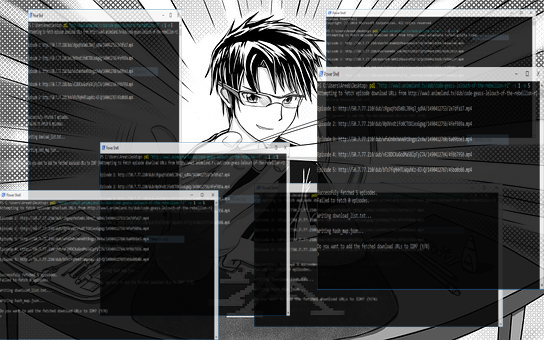

anime-scraper
=============

This is a simple collection of simple web scrapers that extracts the MP4 download URLs from anime stream/download websites.
I made it because of my love for anime and put it on GitHub to share with my IRL friends who are crazy about anime like me.

This scraper simply fetches the download URLs for the episodes. It can also add the download URLs directly to IDM (using the idman
command line utility) with the correct episode names.

Usage
-----

::

    python pdl.py <URL to the anime episode list webpage> -s <start episode> -e <end episode>

Example:

To fetch episodes 10-20 of the anime Clannad:

``python pdl.py "www3.animeland.tv/dub/clannad" -s 10 -e 20``

If you wish to fetch all the episodes skip the --start and --end parameters.

``python pdl.py "www3.animeland.tv/dub/clannad"``

Dependencies
------------

- BeautifulSoup
- cfscrape (for websites using CloadFare DDoS protection)
- demjson

Supported Sites
-----------------

Here's a list of sites the scraper currently works for:

- `animeland.tv <http://animeland.tv/>`_
- `animejoy.tv <http://animejoy.tv>`_

Sites that may be added soon:

- `kissanime.ru <http://kissanime.ru/>`_

Additional Info
---------------

| **Developer:** Areeb Beigh <areebbeigh@gmail.com>
| **GitHub Repo:** https://github.com/areebbeigh/anime-scraper
